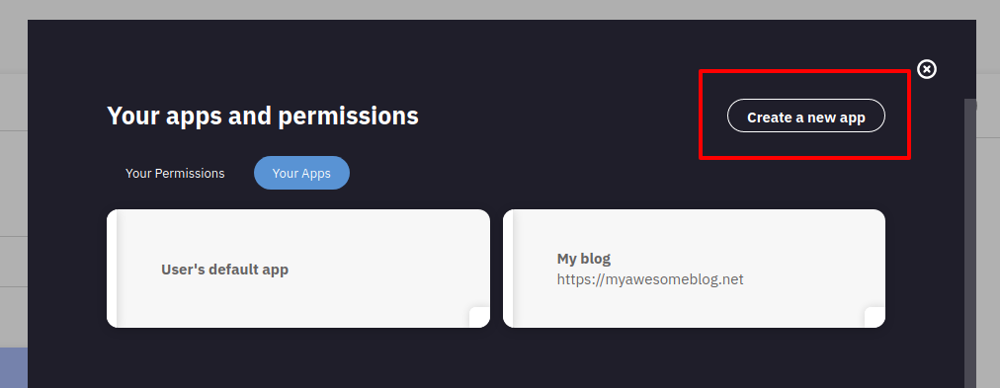
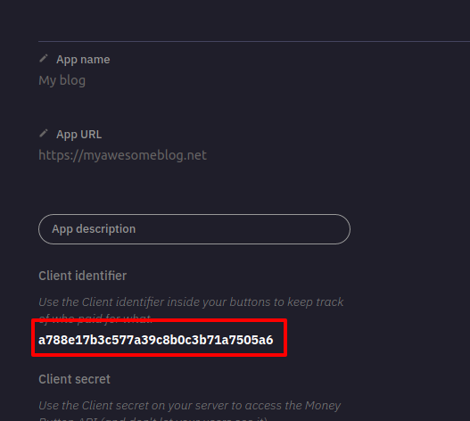
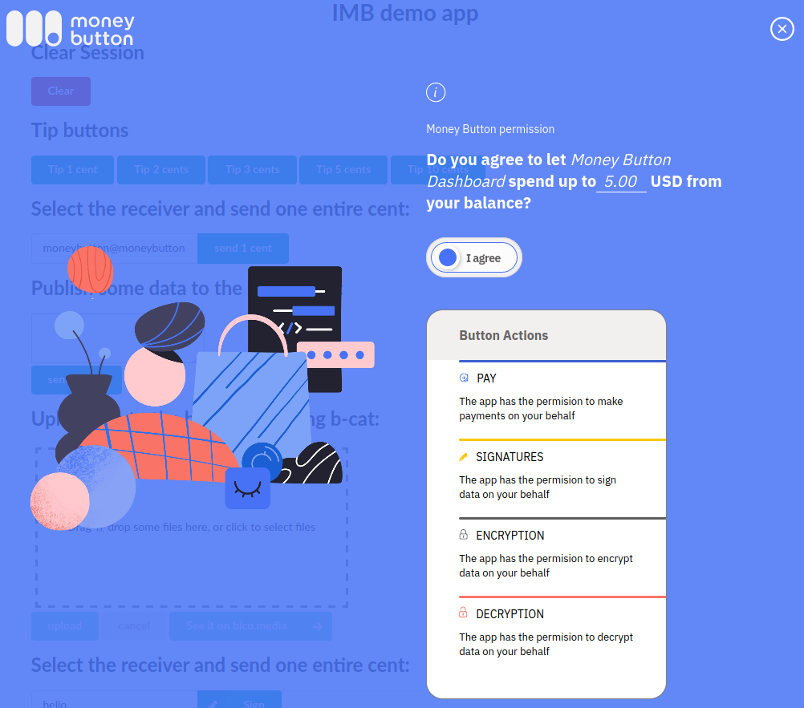

## Overview

Invisible Money Button (IMB) is an API to allow apps to request access to spend
money on the user’s behalf inside of web apps. Additionally, IMB has access to
all Money Button (MB) API features including multiple outputs, scripts,
signatures, encryption, and decryption.

In the regular Money Button flow the user has control over every action by
manually swiping the button. While the swipe is designed to be the best
user-experience for general payments, it is not ideal for every use-case.
Sometimes apps require many small interactions with the user’s wallet. Having to
consciously approve every transaction or API call is cumbersome for the user.

Invisible Money Button solves this issue by letting the user set a limit on the
amount of money the app can spend. This way, the user can do transactions inside
the app without having to constantly swipe the button but retaining full control
over their balance at the same time.

Please [read our announcement for
users](https://blog.moneybutton.com/2020/04/20/invisible-money-button-give-apps-permission-to-work-for-you/)
or our [announcement for
developers](https://blog.moneybutton.com/2020/04/20/invisible-money-button-a-new-api-to-swipe-money-button-automatically-inside-web-apps/).

## How to use Invisible Money Button

### Prerequisites

Invisible Money Button is designed to be easy to use for developers. You need to
do three things:

#### 1. Register your app on the settings page

You can register your app on the [settings page](https://www.moneybutton.com/settings/apps). Please see the [app documentation](./api-apps.md) for more information.



It's important to use the real name and real URL of your app so that the user
recognizes it when they grant permissions. The URL is a part of IMB security
validations and it needs to have the same domain as the domain in the user's web
browser when granting permissions. In development you will have a different
domain, such as localhost, and in order to use it you will need to create an app for
development where the domain is the same as your development environment.

#### 2. Get your clientIdentifier.



That `clientIdentifer` is required to track the permissions your app uses with
IMB. The `clientIdentifier` is plugged into the constructor of the IMB instance
and you need to have it on-hand.


#### 3. Load the moneybutton.js library in your webapp.

``` html
<script src="https://www.moneybutton.com/moneybutton.js"></script>
```

## API

Interactions with Invisible Money Button are made through the `imb` object. Making a
payment using Invisible Money Button is as simple as this:

``` js
const imb = new moneyButton.IMB({ clientIdentifier: '<your client identifier>' })
imb.swipe({
  to: 'moneybutton@moneybutton.com',
  amount: '1',
  currency: 'USD'
}).then(({ payment }) => showSuccess(payment), error => showError(error))
```

When the `swipe` method is called the user is going to be prompted to allow
the current app to spend up to certain amount of money:



If the user agrees, the payment will be executed, and the app will be able to
continue making payments until it runs out of the permitted amount.

With this basic API you can access all the features of Money Button without
the need for the user to swipe for every transaction. If you are familiar
with the Money Button API you are going to find the rest of this document pretty similar.

The IMB API allows you to use every feature of Money Button. You can provide a lot of
customization over the user experience.

### Constructor

`IMB` objects are built passing a `config` object as parameter:

``` js
const config = { ... }
const imb = new moneyButton.IMB(config)
```

The `config` object can contain the following attributes:


- `clientIdentifier` (mandatory, string): Your app's client identifier. You can
  check your apps' client identifiers here:
  https://www.moneybutton.com/settings/apps
- `suggestedAmount` (optional, object): This attribute allows the developer to
  choose how much money the users are going to be suggested to authorize.
  It is the amount that appears as prefilled in the permission popup. Like
  every amount of money in Money Button, is an object with 2 keys: `amount` and
  `currency`.
- `minimumAmount` (optional, object): For some apps, if the user allows a very
  low amount of money the experience is broken. Therefore the apps have the
  ability to choose a minimum amount for the users to authorize. If the users
  try to authorize less than this amount, they will get an error. Like every
  money amount in Money Button, this is an object containing `amount` and
  `currency`.
- `permission` (optional, string): This is a permission token provided by Money
  Button in the past. This permission token allows IMB to live more than the
  current session. We will explain more about this in the next section.
- `onNewPermissionGranted` (optional, function): Every time a user gives
  permission to an app, a permission token is created. When that happens, this
  handler is called. This is useful to keep the `imb` permission state full. More
  about this in the next section.


This an example using all the possible configurations for `imb`:

``` js

const config = {
  clientIdentifier: '<your client identifier>',
  suggestedAmount: {
    amount: '3',
    currency: 'USD'
  },
  minimumAmount: {
    amount: '0.10',
    currency: 'USD'
  },
  permission: getPermissionForCurrentUser(),
  onNewPermissionGranted: (token) => savePermissionToken(token)
}

const imb = new moneyButton.IMB(config)
```

Usually `permission` and `onNewPermissionGranted` are used together. Using these
attributes you can save and load the permission token easily.

When a user grants permission to an app to spend up to certain amount of money,
a permission token is created. That token only works for that user in the
context of that app. The token cannot be used with a different `clientIdentifer`
or a different domain. That’s why the app can safely save the token. If the app
saves the token in its backend, and retrieves it every time the user logs in,
the user can keep using the same permissions they granted the first time, and
they don't have to authorize the same app again.

### swipe

This method is the main interaction between the developers and the `imb` object.
It simulates our classic user interaction, the swipe.

Every time the `swipe` method is called Invisible Money Button tries to build a
transaction or execute crypto operations in the name of the user who granted
permission.

The `swipe` method is asynchronous, and that’s why the response is a promise. If
the promise gets fulfilled an object with the details of that transaction is returned.

``` js
imb.swipe({
  amount: '1',
  currency: 'USD',
  to: 'moneybutton@moneybutton.com'
}).then(
  ({payment, cryptoOperations}) => console.log(payment, cryptoOperations)
)
```

If no crypto operations are specified then `cryptoOperations` is an empty list.
If no outputs are specified for the payment, then `payment` is null. See more
information about [the crypto operations API](./mb-crypto-operations.md) for
creating signatures and encryption.

The swipe method can be configured in the same way as a regular Money Button.
Every valid configuration option for Money Button is also valid for Invisible
Money Button. Nevertheless, not all the classic Money Button configuration
options make sense in IMB.

Here is the list of attributes that can be used, and are meaningful, for IMB:

| Attribute          | Type     | default  |
| ------------------ | -------- | -------- |
| outputs            | array    | []       |
| cryptoOperations   | array    | []       |
| buttonId           | string   | null     |
| buttonData         | string   | null     |
| opReturn           | string   | null     |
| amount             | string   | null     |
| to                 | string   | null     |
| currency           | string   | null     |
| onPayment          | function | () => {} |
| onCryptoOperations | function | () => {} |
| onError            | function | () => {} |

All of these attributes behave exactly the same as a regular [javascript Money
Button](./mb-javascript.md). A regular Money Button can also receive other configuration
attributes like label or successMessage, but they are ignored because they do
not have meaning for an Invisible Money Button.

#### onCryptoOperations, onPayment and onError

These are callbacks executed in specific moments of the payment.
`onCryptoOperations` is called when the crypto operations are succesfully
applied. Then, if the payment is sucessful, `onPayment` is executed. If there
is an error, none of those are executed, `onError` is executed instead.

Note that the functionality of these three callbacks overlaps with the promise
interface. The promise interface is usually more suitable for modern javascript
development. Still, you can use both at the same time. In that case you will see
both things happening: callbacks being executed and promise being handled.

``` js

imb.swipe({
  outputs: [{ to: 'moneybutton@moneybutton.com', amount: '0.1', currency: 'USD' }],
  onCryptoOperations: () => console.log('onCryptoOperations'),
  onPayment: () => console.log('onPayment'),
  onError: () => console.log('onError')
}).then(
  () => console.log('promise fulfilled'),
  () => console.log('promose rejected')
)

// If the payment succeeds log:
// => onCryptoOperation
// => onPayment
// => promise fulfiled


// If the payment fails log:
// => onError
// => promise rejected
```

You will probably find that the promise interface for IMB is easier to use than
the callbacks. It's more declarative and easier to plug into other libraries.

The callback interface is 100% compatible with regular Money Button, this means
that if you already have an app using the Money Button widget, you can easily
plug your button configuration into IMB and it will work.


### amountLeft


Sometimes it is useful to know how much money the app has left to spend before
the user needs to authorize more. You can check this with the amountLeft()
method. This method returns a promise that resolves into an amount. It also
returns the conversion to satoshis. Remember that the user authorizes amounts in
their local currency, so the number of satoshis might change with time, even if
there are no transactions.

``` js
imb.amountLeft().then(amount => console.log(amount))
// => { amount:  '3.47', currency: ‘USD’, satoshis: ’123123’ }
```

### askForPermission

Sometimes it's useful to request the user's permission before starting a
transaction. This method does exactly that.

The `minimumAmount` and `suggestedAmount` used are the one used when the `imb`
instance were created. But you can also set custom ones:


``` js

imb.askForPermission({
  minimumAmount: {
    amount: '0.1',
    currency: 'USD'
  },
  suggestedAmount: {
    amount: '10',
    currency: 'USD'
  }
}).then(
  () => console.log('success'),
  () => console.error('error')
)
```

## Usage with async/await.

The IMB API is fully based in promises, which makes it completely suitable for
async/await syntax. You can do something like this, for example:

``` js
async function myHandler (imb) {
  try {
    const payment = await imb.swipe({
      to: 'moneybutton@moneybutton.com',
      amount: '1',
      currency: 'USD'}
    )
    await processPayment(payment)
  } catch (e) {
    console.error(e)
  }
}
```

## General recommendations.

IMB gives a lot of power to the app developers. And with great power comes a
great responsibility. We provide some general recommendations that will give you and 
the user the best possible experience with your app:


- Set the correct `suggestedAmount` so that the user is not surprised to be
  asked to grant an amount that is too high or too low for your app.
- Set the correct `minimumAmount`  so that the user is not surprised to have to
  re-authorize permission too regularly.
- Contemplate and handle error cases. Every IMB swipe might go wrong for a
  variety of reasons. The user may run out of money, the ‘too long mempool’ [25
  chained transaction limit could be
  reached](https://blog.moneybutton.com/2019/02/11/raising-the-speed-limit-of-unconfirmed-transactions/)
  or something else might happen in the middle. In order to ensure the best
  possible user-experience it is important to provide feedback when something
  goes wrong.
- Manage asynchronism. IMB is extremely asynchronous and sometimes a swipe can
  take a very long time. A single swipe includes conversation between your app,
  the user’s wallet, Money Button servers and the blockchain. It is remarkable
  how fast this happens considering how complex it is, but nonetheless it might
  happen that a particular swipe takes a long time. It’s important to provide
  good feedback for that, such as having a spinning icon while the swipe is
  being processed, and not providing a success icon until the swipe has actually
  finished.
- Let the user know where the money is being spend. People like to have control
  over their money.
- Invisible Money Button works great with micro payments and small interactions.
  If in some moment of your flow you expect a bigger payment, consider using the
  classic Money Button widget. This will allow the user to be completely conscious
  about their money, and also allows your app to do better usage of the
  authorized amount.

## Frequently Asked Question


> Q: What happen if the app runs out of granted balance?

A: When the app tries to make the first payment with no remaining balance, the
user will be prompted to grant a new spend permission to the app. If the user
agrees to grant a new permission, the payment will be made, and then the promise
will be fulfilled.


> Q: As a user can I authorize an amount of 0?

A: Yes, you can. For some apps this makes sense, because it gives them access to
the crypto operations API, but not to the user’s money.


> Q:  Does Money Button introduce any other UI element in my app aside of the
> permission popup?

A: Yes, we do. We provide visual feedback to the user for certain common errors,
like the [25 chained transaction
error](https://blog.moneybutton.com/2019/02/11/raising-the-speed-limit-of-unconfirmed-transactions/).


> Q: Can the user authorize more money than what they have?

A: Yes, the user can authorize to spend more money than they have. The amount of
money that the user can grant to an app is not related to the balance of their
wallet. If the app tries to make a payment and the user does not have enough
money, then a `not enough balance` error is returned. The user is also prompted
to top up their wallet. The reason for this is that for many apps the user will
earn or deposit money while using the app and they do not want to re-grant
permission too often.


> Q: Can I use IMB alongside with the classic Money Button widget?

A: Yes, you can! And probably you should. If the user swipes the classic Money
Button, that doesn't interact with the authorized amount for IMB. A good
practice is make micro payments and small transactions with IMB and use the
widget for bigger transactions or important actions.
